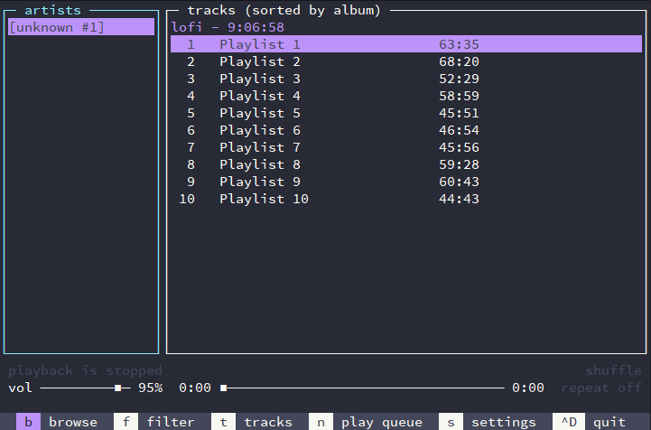

# Dracula for [musikcube](https://github.com/clangen/musikcube)

>A dark theme for [musikcube](https://github.com/clangen/musikcube)

## Install

All instructions can be found at [draculatheme.com/musikcubex](https://draculatheme.com/musikcube).

## Team

This theme is maintained by the following person(s) and a bunch of [awesome contributors](https://github.com/dracula/musikcube/graphs/contributors).

 |
--- |
[quetzal-ux](https://github.com/quetzal-ux) |

## License

[MIT License](./LICENSE)
